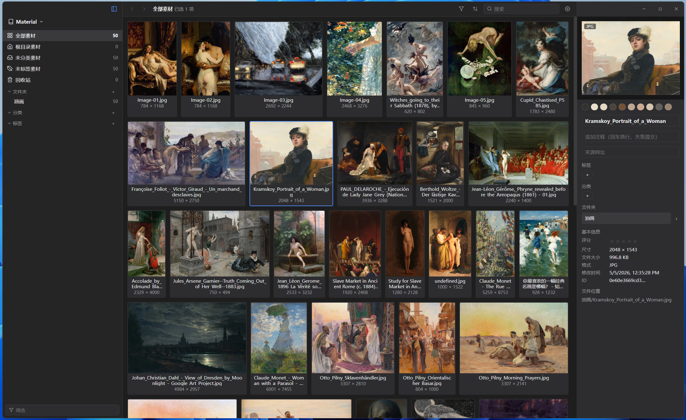

<p align="center">
  
</p>

<h1 align="center">hawk</h1>

<p align="center">对标 Eagle 的开源图片素材管理工具</p>

<p align="center">
  <a href="https://github.com/soryu-ryouji/hawk/actions/workflows/ci.yml"></a>
  <a href="https://github.com/soryu-ryouji/hawk/releases/latest"></a>
  <a href="https://github.com/soryu-ryouji/hawk/releases/tag/nightly"></a>
  <a href="https://github.com/soryu-ryouji/hawk/releases"></a>
  <a href="LICENSE"></a>
</p>

- 非侵入式资源管理：资源以文件夹的形式进行管理，非侵入式
- 自由开放：开放的 REST API，方便生态接入
- 免费

## 截图



## 路线图

- 1.0 版本
  - [x] 实现 hawp-daemon
  - [x] 实现 Windows, MacOS, Linux 桌面客户端
  - [x] 实现 web 资源查看器：局域网内通过浏览器访问素材库
  - [x] 实现 Chrome 浏览器插件
- 2.0 版本
  - [ ] 实现 hawk remote 协议，支持广域网素材库查看
  - [ ] 拓展素材资源管理范围，增加 3D 模型， 游戏引擎资源查看功能
- 3.0 版本
  - [ ] 实现 ios, android 等移动端 app

## 核心特性

### 非侵入式资源管理

hawk 不会将你的素材"导入"到某个专有仓库中。你的文件始终保存在原来的文件夹里，素材目录中也不会出现任何 hawk 的文件——所有数据都收敛在一个 `.hawk/` 隐藏文件夹中。

- 卸载 hawk 后，你的素材文件纹丝不动
- 原有的文件夹组织习惯完全保留
- 与网盘（Dropbox、iCloud、Syncthing、OneDrive）天然兼容

### 纯文本元数据存储

素材参数（标签、评分、备注等）以独立的纯文本文件存放在 `.hawk/metadata/` 中。网盘同步冲突只影响单个素材，可以用 Git 管理素材库，没有数据锁定。

本机加速：库外缓存目录维护一份 SQLite 派生缓存（`index.db`），启动时一次顺序读即可注水索引（内存索引与元数据都从缓存恢复，秒级就绪），十万级素材无需全量解析 TOML，也无需先全库扫描。缓存只是 TOML 的镜像，可随时删除、重启自动重建，不参与同步。

### 前后端解耦

后端是独立的 Rust 服务，前端只通过 REST API 通信。桌面版用 Electron 壳拉起后端进程；同一套后端未来可直接部署为多人使用的服务器版本。

### 开放 REST API

```text
# 搜索素材
POST http://localhost:27371/api/v1/item/list
{ "keywords": ["logo"], "tags": ["品牌"], "star": 5 }

# 获取缩略图
GET http://localhost:27371/api/v1/item/thumbnail?id=abc123

# 更新标签
POST http://localhost:27371/api/v1/item/update
{ "id": "abc123", "tags": ["待审核"] }
```

## 构建与安装

工具链：安装最新的 [Node.js](https://nodejs.org/) 与 [Rust](https://rustup.rs/) 即可。

```bash
git clone https://github.com/soryu-ryouji/hawk.git
cd hawk

# 本机安装：构建应用并安装到本机
./tools/install.ps1              # Windows → out/（免安装目录，hawk.exe 就地可运行）
./tools/install.ps1 -Path D:/Tools/hawk   # Windows → 指定目录
./tools/install.sh               # macOS → /Applications/hawk.app；Linux → out/hawk-linux-x64.AppImage

# 发包：产出分发包到 out/
./tools/build.ps1      # Windows → out/hawk-windows-x64.zip
./tools/build.sh       # macOS → out/hawk-mac-<arch>.zip；Linux → out/hawk-linux-x64.AppImage
./tools/build.ps1 -Extensions    # 附带浏览器插件（out/hawk-extension-chrome|firefox/，加载已解压扩展即用）
```

首次运行自动安装 npm 依赖并完成全量构建（前端 + Rust 后端 + electron-builder，约几分钟）。
开发调试（`cd hawk-app && npm run dev`）与更多命令见 [hawk-app/README.md](hawk-app/README.md)；发版流程见 [docs/release.md](docs/release.md)（CI 定义在 [ci.yml](.github/workflows/ci.yml)）。

## 文档

**总体**

- [架构设计](docs/architecture.md)：进程模型、桌面/服务器部署形态、仓库结构
- [技术栈](docs/tech-stack.md)：语言与框架选型
- [发布流程](docs/release.md)：stable/nightly 双通道、版本号规则、发版步骤与 CI 行为

**前端**（[hawk-app](hawk-app/README.md)）

- [hawk-app 设计](docs/frontend/hawk-app.md)：Electron 壳 + Vue 前端的界面与接入设计

**后端（hawk-daemon/）**

- [hawk-daemon（Rust 实现）](docs/backend/server-rust.md)：Rust 版实现细节、调试与压测方法
- [hawk-daemon 代码导读](docs/backend/server-code-structure.md)：逐文件职责与关键流程串联
- [REST API V1](docs/backend/server-rest-api-v1.md)：接口定义
- [Category 虚拟分类维度](docs/backend/category.md)：三维组织模型、注册表与批量迁移
- [颜色检索](docs/backend/color-search.md)：调色板提炼与 ΔE 颜色匹配
- [存储设计](docs/backend/storage.md)：`.hawk/` 目录结构、同步边界、索引与缓存

## 许可证

Copyright (c) 2026 soryu-ryouji. 本项目基于 [AGPL-3.0](LICENSE) 授权发布。
